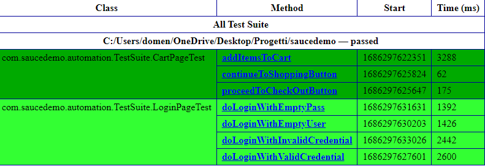
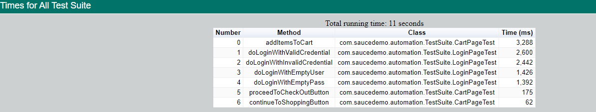

# Saucedemo Automation

## Autometed test for an e-commerce website [saucedemo](https://www.saucedemo.com)

The following pages are automated:

* Login Page
* Cart Page


## Test Plan 1 - LoginPageTest

The login functionalities have been tested with the following test cases and expected behaviour:
  * Test case 001: User gives valid credentials and login is successful: After giving valid credentials of the user, user will be able to successfully login and 
    cart icon will be displayed up on right corner
  * Test case 002: The user tries to login with an empty user: the user gets an error message "Epic sadface: Username is required"
  * Test case 003: The user tries to login with an empty password: the user gets an error message "Epic sadface: Password is required"
  * Test case 004: The user tries to login with invalid credentials: the user gets an error message "Epic sadface: Username and password do not match any user in this service"

## Test Plan 2 - CartPageTest

The cart page functionalities have been tested with the following test cases and expected behaviour:
  * Test Case 005: Add items to Cart: By adding item on chart, the badge will be displayed with the number of the items added
  * Test Case 006: ProceedToCheckOut button will be displayed: Proceed To CheckOut button should be displayed after adding an item to cart
  * Test Case 007: Continue To Shopping button will be displayed: Continue To Shopping button should be displayed after adding to cart

For **LoginPageTest** the username and password used are stored in a `json file` present in the following project path:

`com/saucedemo/automation/testdata/User.json`

For **CartPageTest** the _username_ and _password_ used are:

```
username:standard_user
password: secret_sauce
```

# Framework

* Selenium Webdriver
* IntelliJ IDEA
* Maven
* Java
* TestNG

# To run the automation script

`mvn clean test
`

# Reports





# Allure Reports

`mvn allure:serve
`
